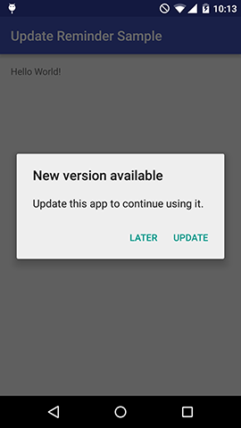

Update Reminder for Android
===





## Installation

### Gradle

```groovy
dependencies {
    compile 'com.github.guitoun3:update-reminder:1.0.0'
}
```

## Usage

```java
new UpdateReminder.Builder(this)
                .setBaseUrl("http://yourdomain.com/")
                .setPath("version.json")
                .build()
                .checkUpdate();
```